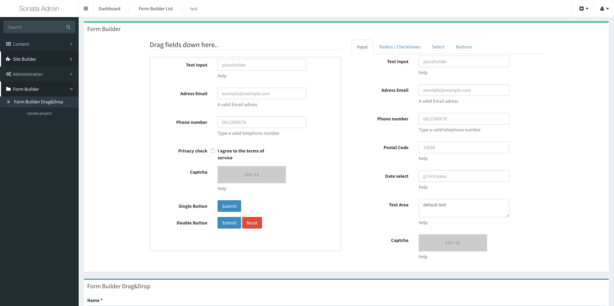

Sonata Form Builder
==========================

A Drag & Drop Form builder inspired from the Git package https://github.com/minikomi/Bootstrap-Form-Builder
and adapted for Sonata-Admin with bootstrap v3 and Jquery

You need Bootstrap v3 and Jquery on your Javascript/CSS requirements and a recent Sonata Admin installation.



-----------------------------------

##Install the bundle

###Step 1: Download the bundle
 
You can download and put on your /src directory (like this  src/Pirastru/FormBuilderBundle)
or insert on your vendor directory with the follow command :

```sh

 php -dmemory_limit=1G ./composer.phar require  pirasterize/sonata-form-builder

```
If you have a >minimum-stability< error is because your symfony installation accept only stable packages.
Edit composer.json file and change "minimum-stability" from "stable" to "dev" :

```
    ...
    "minimum-stability": "dev",
    ...

```


###Step 2: Enable the bundle

Insert the follow line on your AppKernel.php in your symfony :

```php

    class AppKernel extends Kernel
    {
        public function registerBundles()
        {
            $bundles = array(
                // ...

                 new Gregwar\CaptchaBundle\GregwarCaptchaBundle(),
                 new Pirastru\FormBuilderBundle\PirastruFormBuilderBundle()
            );

            // ...
        }

        // ...
    }
```

###Step 3: Configuration

Add the following configuration to your `app/config/config.yml`:

``` yml

    gregwar_captcha: ~

```
    

Add the following configuration to your `app/config/parameters.yml`:

``` yml

    formbuilder_email_from: jeanmichel@basquiat.com

```

###Step 4: Setup the database schema

```sh

    $php app/console doctrine:schema:update --force

```

###Step 5: Setup the routing

Append the following code to app/config/routing.yml or better to separate app/config/routing_admin.yml :

```yml

sonata_form_builder:
    resource: '@PirastruFormBuilderBundle/Controller/FormBuilderController.php'
    type:     annotation

```

###Step 6: Sonata admin setup

In order to have on your list of Admin entities the Form Builder you must put on your configuration file (this case app/config/sonata/sonata_admin.yml), inside of the directive of 'sonata_admin' the follow code :

```yml

sonata_admin:
    ....
    dashboard:
        ....
        groups:
            ...
            sonata.admin.group.formbuilder:
                label: Form Builder
                items:
                    - pirastru_form_builder.admin

```

###Step 7: Sonata blocks setup

In order to have on the list of blocks the Form Builder Block available on a page put on your configuration file (app/config/sonata/sonata_block.yml) the follow line :

``` yml

sonata_block:
    ....
    blocks:
        ....
        pirastru_form_builder.block:

```

###Step 8: Install assets

Run the follow command on your console to install assets :

```sh

    $php app/console  assets:install

```


##To see the result

Check on your Sonata Admin Entities you should see the 'Form Builder' Menu than create a new drag&drop form.
After that create a page from sonata page or edit an existing one and put from the list of available blocks the block called "Form Builder Drag&Drop".
On Options choose the Form you just created, and take a look on the page.


##Todo
- Fields in differents sizes
- Translations
- tests
- remove form fields that are not needed in export - Button/Captcha/Privacycheck

